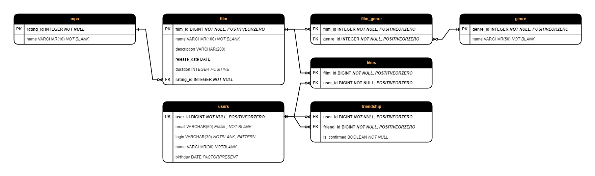

 

  <a href="https://github.com/MironovNikita/Java-Filmorate">
    </img>
  </a>

  <h2 align="center">Filmorate</h2>

  

    An awesome Filmorate app will allow you to make your own rating of films and add friends to discuss and exchange your favourite films with them!
     
     
    <a href="https://github.com/MironovNikita/Java-Filmorate"><strong>Explore the docs »</strong></a>
     
     
    <a href="https://github.com/MironovNikita/Java-Filmorate">View Demo</a>
    .
    <a href="https://github.com/MironovNikita/Java-Filmorate/issues">Report Bug</a>
    .
    <a href="https://github.com/MironovNikita/Java-Filmorate/issues">Request Feature</a>
  

## App database diagram

I make this project while studying at Yandex Practicum on the Java Developer course. This project will allow users to make their own top movies, mark their favorite movies, add other users as friends, and also share their favorite movies with them!

## Built With
- `Spring Boot`
- `Maven`
- `Lombok`

# Filmorate endpoints

### Users
- `[POST] /users` - create a new user
- `[PUT] /users` - update existing user
- `[PUT] /users/{id}/friends/{friendId}` - make two users with `id` and `friendId` as friends :)
- `[GET] /users` - get all users
- `[GET] /users/{id}` - get user by some `id`
- `[GET] /users/{id}/friends` - get all friends of user by some `id`
- `[GET] /users/{id}/friends/common/{otherId}` - get common friends of two users with `id` and `otherId`
- `[DELETE] /users/{id}` - delete user with `id`
- `[DELETE] /users/{id}/friends/{friendId}` - finish friendship of two users with `id` and `friendId` :c

### Films
- `[POST] /films` - create a new film
- `[PUT] /films` - update existing film
- `[PUT] /films/{id}/like/{userId}` - add like from user with `userId` to the film with `id` :)
- `[GET] /films` - get all films
- `[GET] /films/{id}` - get film by some `id`
- `[GET] /films/popular?count={count}` - get amount (as `count`) of the most popular films
- `[DELETE] /films/{id}` - delete film with `id`
- `[DELETE] /films/{id}/like/{userId}` - delete like from user with `userId` to the film with `id` :c

## Authors

* **Mironov Nikita** - *Yandex Practicum Student* - [Mironov Nikita](https://github.com/MironovNikita/) - *Java App student (developer)*